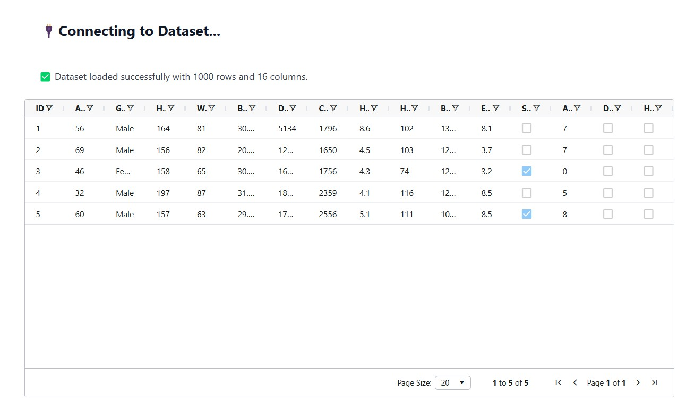
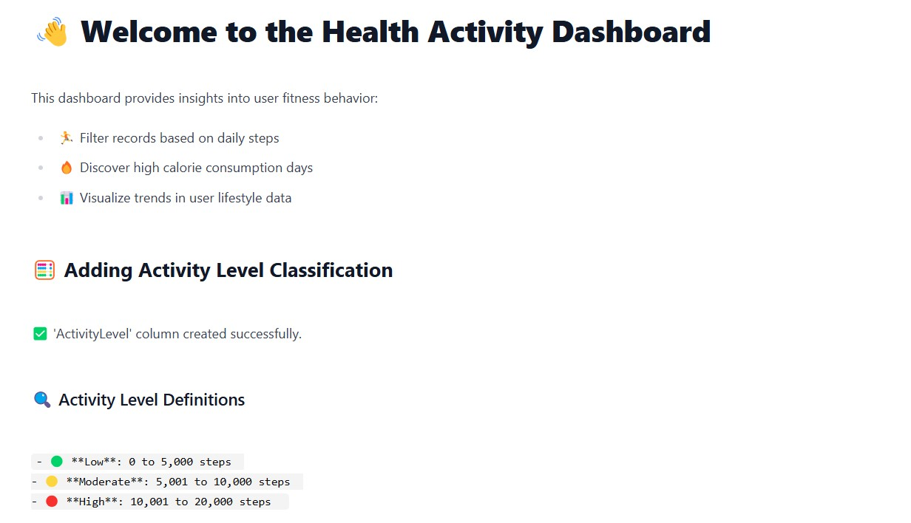
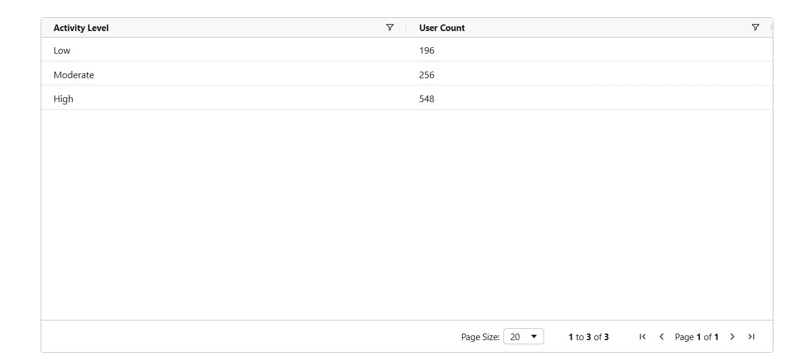
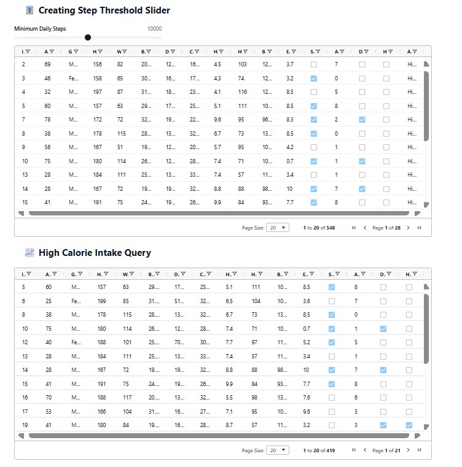
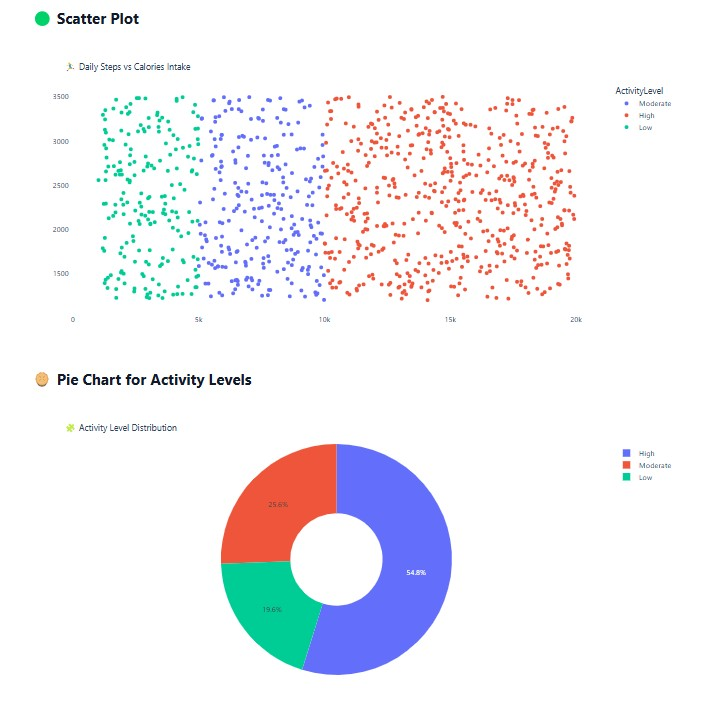
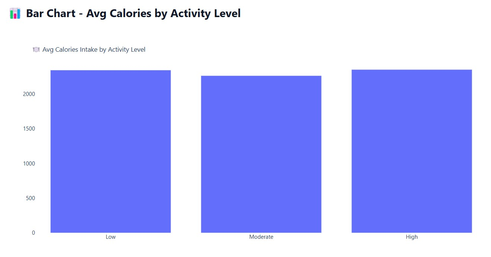

# 🩺 Health Activity Dashboard

This dashboard analyzes daily steps, calorie intake, and health metrics using Preswald.

## 📸 Dashboard Snapshots

### 1. 📊 Filtered Dataset View  

---

### 2. 👋 Welcome Screen  

---

### 3. 📋 Step Threshold Filtering (Slider)  

---

### 4. 🔥 High Calorie Days Query  

---

### 5. 🥧 Activity Level Distribution (Pie Chart)  

---

### 6. 📈 Avg Calorie Intake by Activity Level (Bar Chart)  
